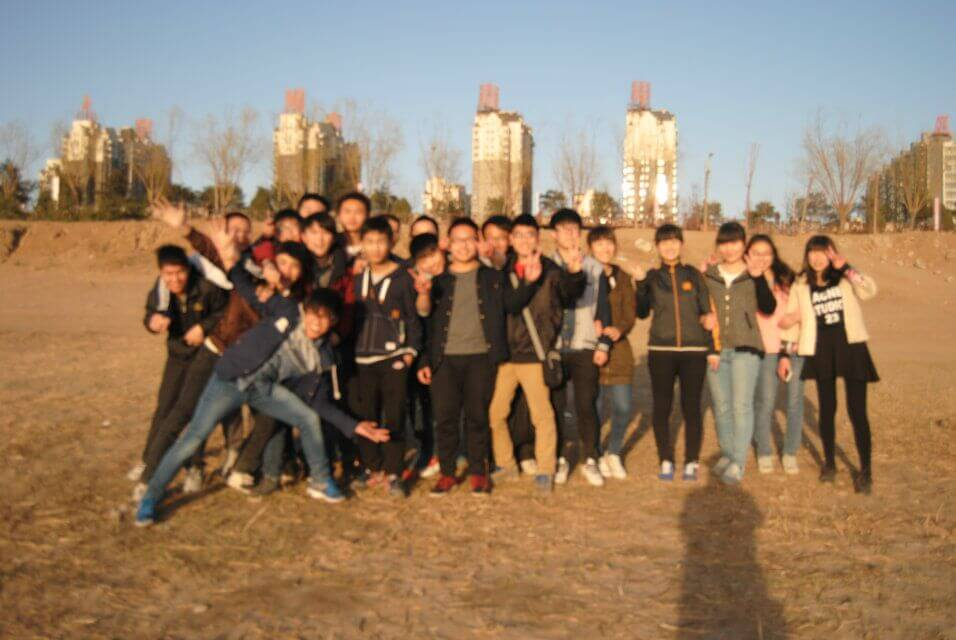
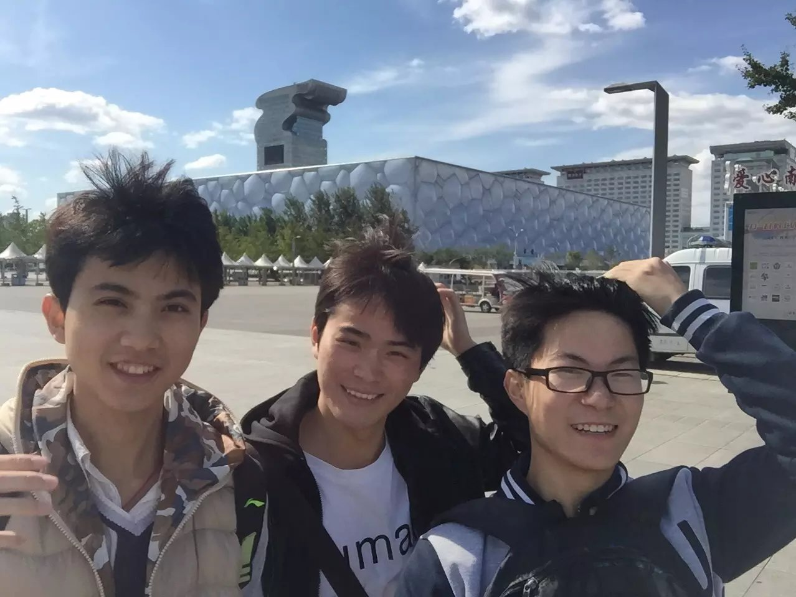

# 追风筝的我们

> 他的橡胶靴子踢起阵阵雪花，已经飞奔到街道的拐角处。  
> 他停下来，转身，双手放在嘴边，说：“为你，千千万万遍！”  
>  
> ---<追风筝的人>  
  
  
  
和你们在一起，很多时候都笑的没心没肺。  
  
还记得那年轻装北上，怀揣着对大学数不清的幻想。  
  
没有百分百的幸运，但是有亿分之一的相遇。  
  
因为你们，满足了我对大学的所有幻想。  
  

还记得那年报道  
  
“你叫什么？”  
  
“我叫许豹”  
  
“行，那以后叫你豹子”  
  
“你呢？”  
  
“我叫楼天楠，你们可以叫我天楠”  
  
“我叫李威威，从安徽来的”  
  
“嗯，那以后叫你威威吧”  
  
“得嘞！”  
  
“你们要不要猜猜看我叫什么”  
  
“尼玛，这也能猜？”  
  
“我叫常诚，啊哈~~~”  
  

当日子不再漫长的时候  
  
一切都显的弥足珍贵  
  
这条路上铺满了树叶  
  
散发着与温度不相称的色调  
  
她把脸埋在围巾里  
  
他则是到处蹦跶蹦跶  
  
“抽根烟取取暖吧~”  
  
“正有此意啊兄弟”  
  
“真恶心，你俩抽烟还有理由啊”  
  
掺杂着寒气和烟味  
  
思绪不知飘到了那里  
  
记忆里的每一帧都是一幅油画  
  

我记的你名字  

也记得你那时的样子  

我听过你少时的凌云壮志  

也听过你经历的悲欢离合  

我想象以后的某一天  

我走在校园  

突然看到你在前面  

我会跑过去拍你的左肩  

说一声“好久不见”  

光阴的故事，放风筝的我们---------未完待续